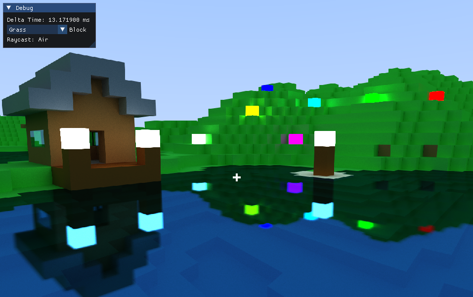

# Voxel Raytracer



Voxel Raytracer using the new SDL3 GPU API with compute shaders

### Building

#### Windows

```bash
git clone https://github.com/jsoulier/voxel_raytracer --recurse-submodules
cd voxel_raytracer
mkdir build
cd build
cmake ..
cmake --build . --parallel 8 --config Release
cd bin
./voxel_raytracer.exe
```

#### Linux

```bash
git clone https://github.com/jsoulier/voxel_raytracer --recurse-submodules
cd voxel_raytracer
mkdir build
cd build
cmake .. -DCMAKE_BUILD_TYPE=Release
cmake --build . --parallel 8
cd bin
./voxel_raytracer
```