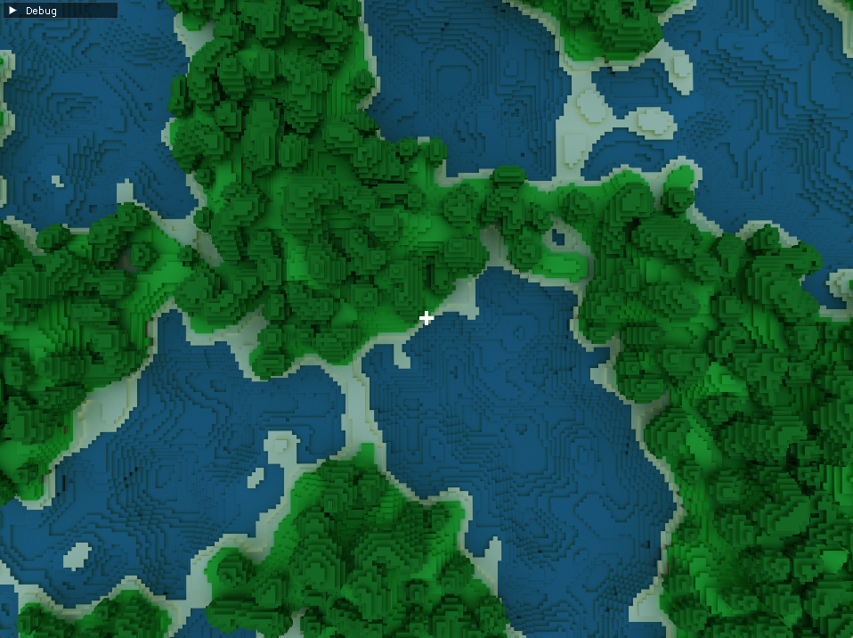

# Voxel Raytracer




Voxel Raytracer using the new SDL3 GPU API with compute shaders

### Building

#### Windows

```bash
git clone https://github.com/jsoulier/voxel_raytracer --recurse-submodules
cd voxel_raytracer
mkdir build
cd build
cmake ..
cmake --build . --parallel 8 --config Release
cd bin
./voxel_raytracer.exe
```

#### Linux

```bash
git clone https://github.com/jsoulier/voxel_raytracer --recurse-submodules
cd voxel_raytracer
mkdir build
cd build
cmake .. -DCMAKE_BUILD_TYPE=Release
cmake --build . --parallel 8
cd bin
./voxel_raytracer
```

### Rendering

Uses a single compute shader [here](shaders/raytrace.comp) with no acceleration structures (and as such, is pretty slow)
1. Start a ray from the camera in world space
2. Convert the ray position to local space
3. Get the current chunk and position within the that chunk
4. Convert the chunk coordinates to chunk data coordinates
5. Index the block texture at the chunk data coordinates and position within the chunk
6. Calculate the intersection location and apply reflection/refraction a few times
7. Accumulate over multiple frames